# Design Pattern
## 1. Factory method
### Định nghĩa
Bản chất của mẫu thiết kế Factory là "Định nghĩa một giao diện (interface) cho việc tạo một đối tượng, nhưng để các lớp con quyết định lớp nào sẽ được tạo. "Factory method" giao việc khởi tạo một đối tượng cụ thể cho lớp con."

### Cách thực hiện
#### Vậy để triển khai mẫu Factory Method phải làm như thế nào ?

#### Ví dụ
Trước hết chúng ta tạo file Interviewer.php với nội dung như sau

```
<?php
namespace App\FactoryMethod;
interface Interviewer
{
    public function askQuestions();
}
```

Tiếp theo là tạo 2 class implements interface `Interviewer`

```
<?php
namespace App\FactoryMethod;

class Developer implements Interviewer
{
    public function askQuestions()
    {
        echo "Ban biet gi ve nghe Developer\n";
    }
}
```
```
<?php
namespace App\FactoryMethod;

class Executive implements Interviewer
{
    public function askQuestions()
    {
        echo "Ban biet gi ve doanh nghiep chung toi\n";
    }
}

```
Bây giờ chúng ta tạo class HiringManager

```
<?php

namespace App\FactoryMethod;

abstract class HiringManager
{
    abstract protected function makeInterviewer(): Interviewer;

    public function takeInterview(){
        $interview = $this->makeInterviewer();
        $interview->askQuestions();
    }
}
```

Bây giờ bất kì lớp con nào cũng có thể mở rộng nó và required `interviewer`

```
<?php

namespace App\FactoryMethod;

class DevelopmentManager extends HiringManager
{
    protected function makeInterviewer(): Interviewer
    {
        return new Executive();
    }
}
```

```
<?php

namespace App\FactoryMethod;

class MarketingManager extends HiringManager
{
    protected function makeInterviewer(): Interviewer
    {
        return new Developer();
    }
}
```

Chạy thử thôi

```
<?php
use App\FactoryMethod\DevelopmentManager;
use App\FactoryMethod\MarketingManager;

require_once __DIR__."/vendor/autoload.php";

$devManager = new DevelopmentManager();
$devManager->takeInterview();
$marketingManager = new MarketingManager();
$marketingManager->takeInterview();
```

**OUTPUT**

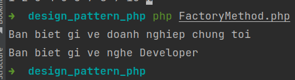


## 2. Abstract Factory Pattern
### Định nghĩa

Là thiết kế mẫu hướng đối tượng trong việc thiết kế phần mềm, cung cấp một giao diện lớp có chức năng tạo ra một tập hợp các đối tượng liên quan hoặc phụ thuộc lẫn nhau mà không chỉ ra đó là những lớp cụ thể nào tại thời điểm thiết kế.[1] Mẫu thiết kế Abstract Factory đóng gói một nhóm những lớp đóng vai trò "sản xuất" (Factory) trong ứng dụng, đây là những lớp được dùng để tạo lập các đối tượng. Các lớp sản xuất này có chung một giao diện lập trình được kế thừa từ một lớp cha thuần ảo gọi là "lớp sản xuất ảo".

Có thể hiểu đơn giản Abstract Factory như 1 siêu nhà máy dùng để tạo ra các nhà máy (factory) khác.

### Cấu trúc
* **AbstractFactory**: định nghĩa một giao tiếp cho thao tác khởi tạo các "sản phẩm" ảo (AbstractProduct)
* **ConcreteFactory**: thực thi giao tiếp AbstractFactory để tạo ra đối tượng cụ thể
* **AbstractProduct**: định nghĩa một lớp ảo cho một loại đối tương "sản phẩm"
* **Product**: kế thừa từ từ lớp "sản phẩm" ảo AbstractProduct, các lớp Product định nghĩa từ đối tượng cụ thể
* **Client**: sử dụng các lớp AbstractFactory và AbstractProduct trong hệ thống

#### Ví dụ

**Bước 1:**

Đầu tiên ta tạo một interface Car

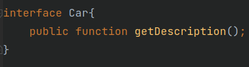

**Bước 2:**

Tạo các class cụ thể implements cùng 1 interface Car ở trên

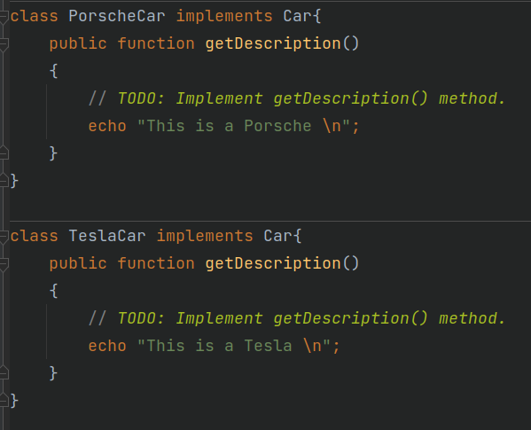

**Bước 3:**

Tạo 1 interface partCar

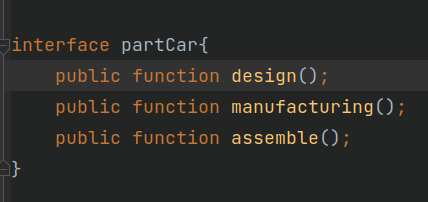

**Bước 4:**

Tạo các class implements cùng 1 interface partCar tương tự như bước 2
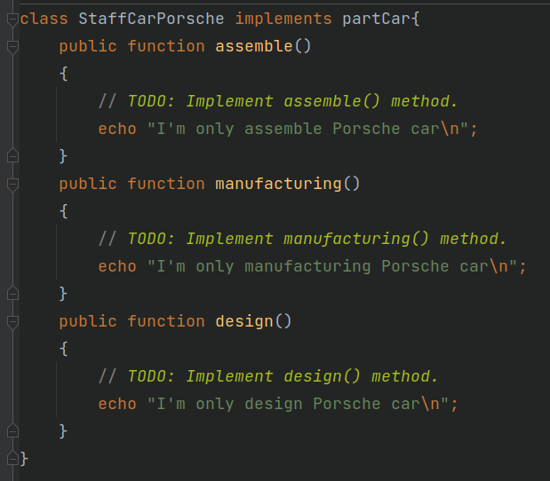

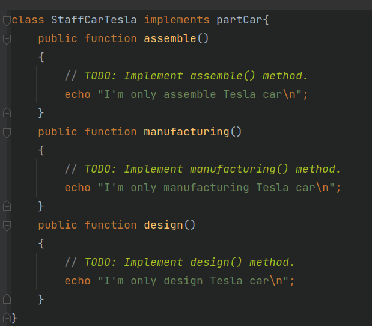

**Bước 5:**
Tạo ra 1 interface với phương thức gián tiếp đến thao tác khởi tạo các Car và Part Car

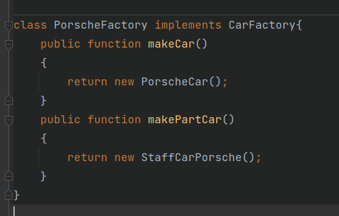

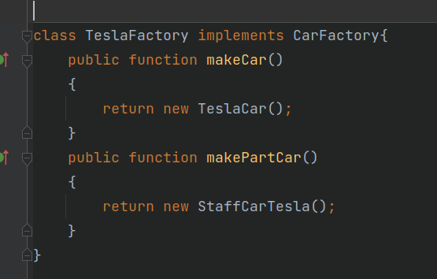

**Bước 6:**
Test thử thôi

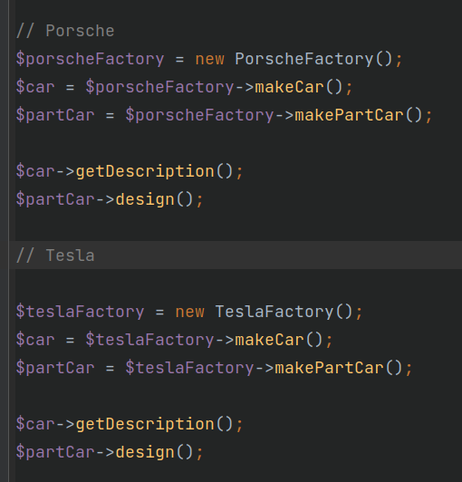


**Output**

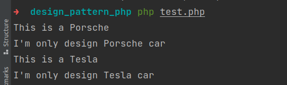

## 3. Simple Factory
### Định nghĩa
Ví dụ: Bạn đang xây một ngôi nhà và bạn cần những cánh cửa. Bạn có thể mặc quần áo thợ mộc của mình, mang theo một ít gỗ, keo dán, đinh và tất cả các dụng cụ cần thiết để tạo ra cánh cửa và bắt đầu lắp ráp nó trong ngôi nhà của bạn hoặc bạn có thể chỉ cần gọi cho nhà máy và đặt cánh cửa đã đóng sẵn cho bạn để bạn không cần phải học bất cứ điều gì về việc làm cửa hoặc đối phó với mớ hỗn độn đi kèm với việc làm ra nó.

**Đầu tiên ta tạo ra interface Door**
```
<?php
namespace App\SimpleFactory;
interface Door
{
    public function getWidth(): float;
    public function getHeight(): float;
    public function area(): float;
    public function perimeter(): float;
}
```
Tiếp theo tạo class WoodenDoor implements Door để thực hiện các hàm
```
<?php
namespace App\SimpleFactory;
class WoodenDoor implements Door
{
    protected $width;
    protected $height;

    public function __construct(float $width, float $height)
    {
        $this->width = $width;
        $this->height = $height;
    }

    public function getWidth(): float
    {
        return $this->width;
    }

    public function getHeight(): float
    {
        return $this->height;
    }

    public function area(): float
    {
        $area = $this->width*$this->height;
        return $area;
    }

    public function perimeter(): float
    {
        $perimeter = ($this->width)*2 + ($this->height)*2;
        return $perimeter;
    }
}
```

Tiếp theo là tạo class DoorFactory để thực hiện lắp ráp cánh cửa và trả về các thông số

```
<?php
namespace App\SimpleFactory;
class DoorFactory
{
    public function makeDoor($width, $height):Door
    {
        return new WoodenDoor($width, $height);
    }
}
```

Chạy thử thôi

```
<?php
require __DIR__."/vendor/autoload.php";
use App\SimpleFactory\DoorFactory as DoorFactory;
$door = new DoorFactory();
$makeDoor = $door->makeDoor(5,4);
echo 'Width: ' . $makeDoor->getWidth() . "\n";
echo 'Height: ' . $makeDoor->getHeight() . "\n";
echo "Area: ". $makeDoor->area(). "\n";
echo "Perimeter: ". $makeDoor->perimeter()."\n";
```

**OUTPUT**

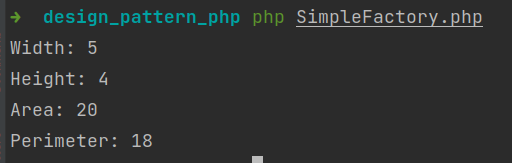

## 4. Facade

### Định nghĩa:
Facade là một lớp cung cấp một giao diện đơn giản cho một hệ thống con phức tạp chứa nhiều bộ phận chuyển động. Một Facade có thể cung cấp chức năng hạn chế so với làm việc trực tiếp với hệ thống con. Tuy nhiên, nó chỉ bao gồm những tính năng mà khách hàng thực sự quan tâm.

**Ví dụ**

Đầu tiên ta có 3 class Youtube, FFMpeg, FFMpegVideo
```
<?php
namespace App\Facade;
class YouTube
{
    public function fetchVideo(): string {
        return "Fetch video\n";
    }
    public function saveAs(string $path, string $name): void {
        echo "Path: ".$path."\n";
        echo "Name: ".$name."\n";
    }
    public function getTitle(){
        echo "Title from FetchVideo\n";
    }
}
```

```
<?php

namespace App\Facade;

class FFMpeg
{
    public static function create(): FFMpeg {
        return "FFMpeg";
    }
    public function open(string $video): void {
        echo "Open video: ".$video;
    }
}
```

```
<?php

namespace App\Facade;

class FFMpegVideo
{
    public function filters(): self {
//        return "Filters";
        echo "123\n";
        return $this;
    }

    public function resize(): self {
        echo "Resize\n";
        return $this;
    }

    public function synchronize(): self {
        echo "Synchronize\n";
        return $this;
    }

    public function frame(): self {
        echo "Frame\n";
        return $this;
    }

    public function save(string $path): self {
        echo "Save: ".$path."\n";
        return $this;
    }
}
```

Facade cung cấp một phương pháp duy nhất để tải video từ YouTube. Phương pháp này ẩn tất cả sự phức tạp của lớp mạng PHP, API YouTube và thư viện chuyển đổi video (FFmpeg, FFmpegVideo).
```
<?php
namespace App\Facade;
class YouTubeDownloader
{
    protected $youtube;
    protected $ffmpeg;
    protected $ffmpegvideo;

    public function __construct(string $youtubeApiKey)
    {
        $this->youtube = new YouTube($youtubeApiKey);
        $this->ffmpeg = new FFMpeg();
        $this->ffmpegvideo = new FFMpegVideo();
    }

    public function downloadVideo(string $url): void
    {
        $title = $this->youtube->fetchVideo();
        echo $title;
        $this->youtube->saveAs($url, "video.mpg");
        $video = $this->ffmpeg->open('video.mpg');
        echo "\n";
        $videos = $this->ffmpegvideo;
        $filters = $videos
            ->filters()
            ->frame()
            ->resize()
            ->synchronize()
            ->save('video.mpg');
    }
}
```

Client code không phụ thuộc vào bất kỳ lớp nào của hệ thống con. Bất kỳ thay đổi nào bên trong code của hệ thống con sẽ không ảnh hưởng đến client. Bạn sẽ chỉ cần cập nhật Facade.

```
<?php
use App\Facade\YouTubeDownloader;
require_once __DIR__."/vendor/autoload.php";

function clientCode(YouTubeDownloader $facade)
{
    $facade->downloadVideo("https://www.youtube.com/watch?v=ZoNfrTfwhEU");
}

$facade = new YouTubeDownloader("APIKEY-XXXXXXXXX");
clientCode($facade);
```

`OUTPUT`

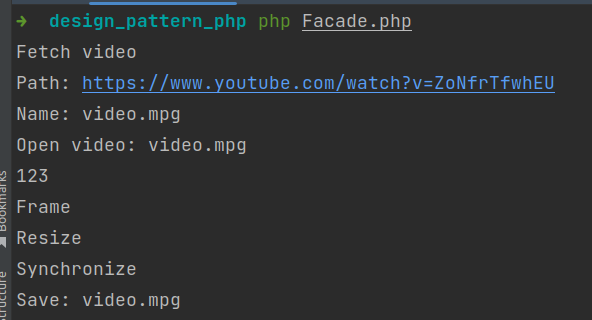


## 5. Singleton
### Định nghĩa
Singleton là một mẫu thiết kế sáng tạo, đảm bảo rằng chỉ có một đối tượng cùng loại tồn tại và cung cấp một điểm truy cập duy nhất vào nó cho bất kỳ mã nào khác.

Singleton gần như có những ưu và nhược điểm giống như các biến toàn cục. Mặc dù chúng siêu tiện dụng nhưng chúng phá vỡ tính mô-đun của mã của bạn.

Bạn không thể chỉ sử dụng một lớp phụ thuộc vào Singleton trong một số ngữ cảnh khác mà không chuyển Singleton sang ngữ cảnh khác. Hầu hết thời gian, hạn chế này xuất hiện trong quá trình tạo các bài kiểm tra đơn vị.


**Ví dụ**

Lớp Singleton định nghĩa phương thức `GetInstance` đóng vai trò là một phương thức thay thế cho hàm tạo và cho phép clients truy cập lặp đi lặp lại cùng một phiên bản của lớp này.

```
<?php

namespace App\Singleton;

final class Singleton
{
    private static $instances = [];

    protected function __construct() {

    }

    protected function __clone() {

    }

    public function __wakeup()
    {
        throw new \Exception("Cannot unserialize a singleton.");
    }
    public static function getInstance(): Singleton
    {
        $cls = static::class;
        if (!isset(self::$instances[$cls])) {
            self::$instances[$cls] = new static();
        }

        return self::$instances[$cls];
    }

    public function someBusinessLogic()
    {
        // ...
    }
}
```

Test thử thôi

```
<?php
use App\Singleton\Singleton;
require_once __DIR__."/vendor/autoload.php";

$s1 = Singleton::getInstance();
$s2 = Singleton::getInstance();
if ($s1 === $s2) {
    echo "Singleton works, both variables contain the same instance.";
} else {
    echo "Singleton failed, variables contain different instances.";
}
```
`OUTPUT`

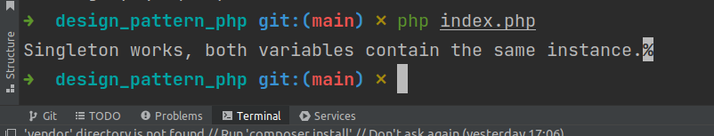

## 6. Builder
### Định nghĩa

Builder là một mẫu thiết kế sáng tạo cho phép bạn xây dựng các đối tượng phức tạp theo từng bước. Pattern này cho phép bạn tạo ra các kiểu và biểu diễn khác nhau của một đối tượng bằng cách sử dụng cùng một đoạn code.

Ví dụ: hãy nghĩ về cách tạo đối tượng Ngôi nhà. Để xây dựng một ngôi nhà đơn giản, bạn cần xây dựng bốn bức tường và một tầng, lắp cửa ra vào, lắp một cặp cửa sổ và xây dựng một mái nhà. Nhưng nếu bạn muốn một ngôi nhà lớn hơn, sáng sủa hơn, có sân sau và các tiện ích khác (như hệ thống sưởi, hệ thống ống nước và hệ thống dây điện)?

Giải pháp đơn giản nhất là mở rộng lớp House cơ sở và tạo một tập hợp các lớp con để bao gồm tất cả các tổ hợp của các tham số. Nhưng cuối cùng bạn sẽ có một số lượng đáng kể các lớp con. Bất kỳ thông số mới nào, chẳng hạn như kiểu hiên nhà, sẽ yêu cầu phát triển hệ thống phân cấp này nhiều hơn nữa.

Có một cách tiếp cận khác không liên quan đến việc lai tạo các lớp con. Bạn có thể tạo một phương thức khởi tạo khổng lồ ngay trong lớp House cơ sở với tất cả các tham số có thể có để điều khiển đối tượng house. Mặc dù cách tiếp cận này thực sự loại bỏ sự cần thiết của các lớp con, nhưng nó lại tạo ra một vấn đề khác.


Ví dụ:
Giao diện Builder khai báo một tập hợp các phương pháp để lắp ráp một truy vấn SQL.
Tất cả các bước xây dựng đang trả về đối tượng trình tạo hiện tại để cho phép chuỗi: $ builder-> select (...) -> where (...)

```
<?php

namespace App\Builder2;

interface SQLQueryBuilder
{
    public function select(string $table, array $fields): SQLQueryBuilder;

    public function where(string $field, string $value, string $operator = '='): SQLQueryBuilder;

    public function limit(int $start, int $offset): SQLQueryBuilder;

    public function getSQL(): string;
}
```

Mỗi Concrete Builder tương ứng với một phương ngữ SQL cụ thể và có thể triển khai các bước của trình xây dựng hơi khác một chút so với các bước khác.
Concrete Builder này có thể xây dựng các truy vấn SQL tương thích với MySQL.

```
<?php

namespace App\Builder2;
class MysqlQueryBuilder implements SQLQueryBuilder
{
    protected $query;

    protected function reset(): void
    {
        $this->query = new \stdClass();
    }


    public function select(string $table, array $fields): SQLQueryBuilder
    {
        $this->reset();
        $this->query->base = "SELECT " . implode(", ", $fields) . " FROM " . $table;
        $this->query->type = 'select';

        return $this;
    }

    public function where(string $field, string $value, string $operator = '='): SQLQueryBuilder
    {
        if (!in_array($this->query->type, ['select', 'update', 'delete'])) {
            throw new \Exception("WHERE can only be added to SELECT, UPDATE OR DELETE");
        }
        $this->query->where[] = "$field $operator '$value'";

        return $this;
    }

    public function limit(int $start, int $offset): SQLQueryBuilder
    {
        if (!in_array($this->query->type, ['select'])) {
            throw new \Exception("LIMIT can only be added to SELECT");
        }
        $this->query->limit = " LIMIT " . $start . ", " . $offset;

        return $this;
    }

    public function getSQL(): string
    {
        $query = $this->query;
        $sql = $query->base;
        if (!empty($query->where)) {
            $sql .= " WHERE " . implode(' AND ', $query->where);
        }
        if (isset($query->limit)) {
            $sql .= $query->limit;
        }
        $sql .= ";";
        return $sql;
    }
}
```

Và đây là khi sử dụng

```
  function clientCode2(SQLQueryBuilder $queryBuilder)
    {
        // ...
        $db = new Database();
        $query = $queryBuilder
            ->select("khach", ["k_id","k_ten","k_gt","k_ngsinh","k_email","k_sdt","k_diachi"])
            ->getSQL();
        $qr = $db->connect()->query($query);
        $ar = [];
        while ($row = $qr->fetch()) {
            array_push($ar, $row);
        }
        return $ar;
        // ...
    }
```

`OUTPUT`

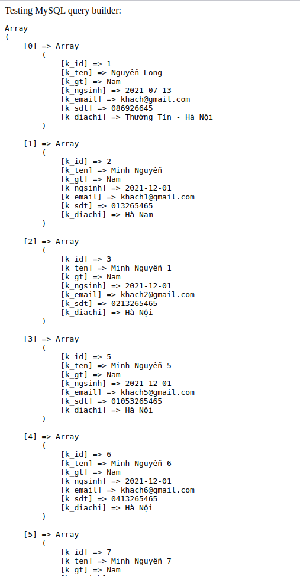